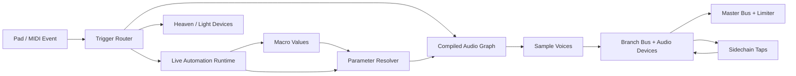

# Sampling, Audio Devices und Live Automation

Status: Implementiert; Desktop-GA-Gates aktiv
Stand: 2026-08-29
Zielplattform für den ersten Release: Desktop (Windows, macOS, Linux)

Umsetzungsstand:

- [x] Epic 0.1 — Audio-Graph- und Routing-Semantik als [ADR 0001](adr/0001-audio-graph-routing.md)
- [x] Epic 0.2 — Persistente Device- und Macro-IDs inklusive Legacy-Migration und Clone-Semantik
- [x] Epic 0.3 — Gemeinsames Parameter-System, Audio-Execution-Plan und Trigger-Foundation

## 1. Zielbild

Amethyst soll Sampling als Teil des bestehenden Performance-Workflows behandeln: Ein Pad-Event läuft durch dieselbe Chain-Idee wie die Lichtsignale, startet oder stoppt Sample-Voices, kann Parameter-Automationen auslösen und erzeugt Audio über Echo. Sound-Design soll sich deshalb wie eine natürliche Erweiterung der vorhandenen Chain Devices anfühlen und nicht wie eine zweite, unabhängige DAW.

Der geplante Funktionsumfang umfasst:

- Sample-Grundfunktionen: Gain, Fade In/Out, Pan, Playback Mode und Choke Group.
- Tempo-Funktionen: Repitch und timestretch-basiertes Warp/Pitch Lock.
- Audio Devices: EQ Three, Filter, Delay, Reverb, Ducker und optional Saturator.
- Live Automation: feste Dauer, Kurve von A nach B, Pad-Trigger und definierte Retrigger-Regeln.
- Macro Mapping: Ein Macro steuert beliebig viele Parameter; Live Automation kann ein Macro steuern.
- Spätere Light-Device-Ableger für Delay und Reverb, ohne Audio- und LED-Renderpfade zu koppeln.

Das erste Qualitätsziel ist eine verlässliche Live-Performance. Ein kleinerer, klickfreier und deterministischer Funktionsumfang ist wertvoller als viele DSP-Optionen mit unklaren Routing- oder Retrigger-Regeln.

## 2. Bestehender Stand

Die Roadmap baut bewusst auf bereits vorhandenem Code auf.

| Bereich | Heute vorhanden | Konsequenz |
|---|---|---|
| Sample Device | Waveform, Start/End, Fade In/Out, Gain, Playhead und polyphone One-Shot-Wiedergabe in `SampleChainDevice` | Erweitern statt ersetzen. |
| Audio Engine | Stereo-Float-Pipeline, vorbereitete Voices, Command Queue, Resampling und Master Limiter in Echo | DSP bleibt in `commonMain`; Plattformcode bleibt Audio-I/O. |
| Audio Chain | Generatoren und Effekte können grundsätzlich in Echtzeit verarbeitet werden | Vor neuen Effekten muss die flache Ausführung zu einem definierten hierarchischen Audio-Graph werden. |
| Trigger | Pad Down und Pad Up erreichen die Sampling Chain als `Signal.Midi` | Gate kann auf demselben Event-Pfad entstehen; der Sample-Renderer ignoriert Pad Up heute noch. |
| Choke | `SampleChainDevice` ist `Chokeable`; `ChokeChainDevice` besitzt globale nummerierte Channels | Für Sampling brauchen wir workspace-lokale Choke Groups pro Sample statt einer statischen Device-Registry. |
| Automation | `DialAutomationLane`, Kurveneditor und automatisierbare Dials existieren | Datenmodell und Editor wiederverwenden, Laufzeit jedoch auf den Audio-Clock umstellen. |
| Macros | Globale Macro-Werte 0–127 und Macro Control/Filter existieren | Stabile IDs, Namen und Parameter-Mappings fehlen. |
| UI | `ChainDeviceShell`, `Dial`/`FlatDial`, `Select`, `Tabs`, `Slider`, `Popover`, `Accordion`, `Tooltip`, Theme- und Chain-Tokens | Neue UI aus diesen Primitives zusammensetzen; keine zweite visuelle Sprache einführen. |
| Mobile | Sampling Mode zeigt aktuell „Currently not available on mobile“ | Desktop zuerst; State, DSP und Primitives trotzdem multiplatform-fähig halten. |

Wichtige technische Lücke: `AudioChain` sammelt heute Audio Devices in eine flache Echtzeit-Liste und übernimmt aus verschachtelten Chains nur Generatoren. Damit sind ein Effekt nur auf einem Sample, echte parallele Gruppen, Sidechain-Taps und nachvollziehbares Bus-Routing noch nicht sauber ausdrückbar.

## 3. Produkt- und Designprinzipien

### 3.1 Performance zuerst

- Pad Down muss sofort sichtbares Feedback geben; Audio darf nicht auf UI oder Netzwerk warten.
- Im Audio Callback gibt es keine Allokationen, Locks, Dateizugriffe oder Flow-Updates.
- Alle laufenden Parameteränderungen werden geglättet, damit Dials, Macros und Automation keine Klicks erzeugen.
- Stop, Choke und Gate Release verwenden einen sehr kurzen konfigurationsfreien De-click-Ramp.
- Ein fehlendes Sample oder Sidechain-Ziel darf weder den Audio-Thread noch die komplette Chain stoppen.

### 3.2 Eine Chain-Metapher

- Sources, Audio Effects, Trigger Tools und Modulation bleiben Chain Devices.
- Reihenfolge und Verschachtelung haben hörbare, dokumentierte Semantik.
- Der Device Picker trennt Signalverarbeitung und Audioverarbeitung sichtbar, obwohl beide dieselbe Chain UI nutzen.
- Ein Sample mit ausschließlich eigenen Effekten liegt in einem Group-Zweig: `Sample -> Filter -> Delay`.

### 3.3 Ein Parameter-System

Jeder steuerbare Wert besitzt einen stabilen Parameter-Descriptor mit:

- stabiler ID, Label und Einheit,
- Wertebereich und Default,
- linearer, logarithmischer oder diskreter Skalierung,
- Formatter/Parser für direkte Texteingabe,
- Automation- und Macro-Fähigkeit,
- Glättungszeit und optionalen Snap Points.

`Dial`, `FlatDial`, Live Automation und Macro Mapping konsumieren denselben Descriptor. DSP-Klassen erhalten nur normalisierte oder bereits in native Werte umgerechnete Parameter-Snapshots.

### 3.4 Bestehende visuelle Sprache

- Farben kommen ausschließlich aus `AmethystColorPalette`, `chainColorTokens` und semantischen neuen Tokens wie `automationActive` oder `audioLevelSafe`.
- `ChainDeviceShell` bleibt Rahmen, Auswahl-, Mute-, Collapse- und Drag-Oberfläche jedes Devices.
- Bestehende Primitives werden verwendet; keine hardcodierten Dark-Mode-Flächen im neuen UI.
- Ein Device hat höchstens eine primäre Akzentfarbe. Farbe ist nie der einzige Zustandsindikator.
- Lucide beziehungsweise der bestehende konsistente Vector-Icon-Satz ersetzt Textzeichen und Emojis.
- Interaktive Ziele sind mindestens 44 × 44 dp, haben Focus/Pressed/Disabled States und verständliche Semantics.
- Motion erklärt Zustandswechsel, dauert in der Regel 150–300 ms und respektiert Reduced Motion. Audio-Feedback wartet nie auf UI-Animationen.

## 4. Zielarchitektur



### 4.1 Event-Modell

`Signal.Midi` wird nicht sofort ersetzt, aber der Sampling-Pfad normalisiert es zu einem Audio-Trigger-Event:

```kotlin
data class PadTriggerEvent(
    val key: PadTriggerKey,       // origin/device + x + y
    val phase: TriggerPhase,      // Down oder Up
    val velocity: Int,            // 0..127
    val targetFrame: Long,        // Audio-Clock, nicht Wall Clock
)
```

Down und Up müssen dieselbe `PadTriggerKey` besitzen. Autoplay, Hardware und On-Screen-Launchpad erzeugen identische Semantik. Die Konvertierung in `targetFrame` erfolgt vor dem Audio Callback.

### 4.2 Persistente Adressen

Parameter- und Sidechain-Ziele dürfen nicht auf Listenindex oder einen beim Laden neu erzeugten Laufzeitwert zeigen.

```text
DeviceAddress = persistentDeviceId
ParameterAddress = persistentDeviceId + parameterId
MacroAddress = persistentMacroId
```

Alle drei IDs werden serialisiert und über Collaboration synchronisiert. Beim Laden älterer Projekte werden fehlende IDs einmalig erzeugt. Entfernte Ziele bleiben als „Missing target“ sichtbar und können neu verbunden werden.

### 4.3 Hierarchischer Audio-Graph

Aus der editierbaren `AudioChain` wird außerhalb des Audio-Threads ein unveränderlicher Execution Plan kompiliert:

- Eine Chain verarbeitet seriell auf ihrem lokalen Stereo-Bus.
- Ein Sample addiert seine Voices auf den aktuellen Bus.
- Ein Audio Effect verarbeitet den aktuellen Bus in-place.
- Group-Zweige rendern in vorallokierte Child-Busse und werden danach in den Parent-Bus summiert.
- Multi entscheidet per Trigger-Routing, welcher Zweig aktiv ist.
- Sidechain-Taps veröffentlichen nur vorallokierte Pegel-/Triggerdaten; sie kopieren keinen vollständigen Audiostream.
- Topology- und Mute-Änderungen bauen den Plan auf dem Control Thread neu und tauschen ihn atomar aus.

Vor der Implementierung wird diese Semantik als kurze ADR festgeschrieben. Insbesondere wird getestet, welche Devices in verschachtelten Sampling-Chains erlaubt sind.

### 4.4 Parameter-Auflösung

Die Reihenfolge für einen Zielparameter ist deterministisch:

```text
gespeicherter Basiswert
  -> Macro Mapping (absolute oder additive, inklusive Range/Invert)
  -> direkte Live Automation (override oder additive)
  -> Clamp/Quantisierung
  -> Smoothing
  -> DSP Snapshot
```

Eine Automation darf ein Macro steuern. Macro-zu-Macro-Mappings sind in v1 nicht erlaubt; dadurch entstehen keine Zyklen. Mehrere Mappings auf denselben Parameter werden in stabiler Reihenfolge ausgewertet.

## 5. Roadmap

### Epic 0 — Audio-Graph und Parameter Foundation

Priorität: P0
Abhängigkeiten: keine
Blockiert: alle Audio Effects, Ducker, Macro Mapping und sample-genaue Automation

#### Scope

- [x] Routing-Semantik und Echtzeit-Invarianten als ADR festschreiben.
- [x] Persistente Device- und Macro-IDs mit Migration alter Projekte einführen.
- [x] `AudioChain` zu einem kompilierten, hierarchischen Execution Plan ausbauen.
- [x] Vorallokierte Branch-Busse und atomaren Plan-Swap implementieren.
- [x] `ParameterDescriptor`/`ParameterAddress` als gemeinsame API für UI, Automation, Macros und DSP definieren.
- [x] Thread-sichere Parameter-Snapshots und per-Parameter Smoothing einführen.
- [x] `PadTriggerEvent` mit Down/Up, stabiler Trigger-Key und Audio-Frame-Zeit etablieren.
- [x] Device-Fähigkeiten deklarativ machen: Source, Audio Effect, Trigger Tool, Modulation, Container.
- [x] Device Picker anhand dieser Fähigkeiten filtern und gruppieren.
- [x] Serialisierungs-, Undo/Redo- und Collaboration-Events für IDs und Mappings ergänzen.

#### UI

Der Sampling Picker erhält die obersten Kategorien `Sources`, `Audio Effects`, `Trigger`, `Modulation` und `Containers`. Bestehende LED-/Signal-Devices wie Coordinate Filter, Hold oder Loop stehen unter `Trigger`; neue DSP-Devices stehen unter `Audio Effects`. Nicht erlaubte Kombinationen werden mit Begründung disabled angezeigt, nicht still ausgeblendet.

#### Akzeptanzkriterien

- Ein `Sample -> Filter` in einem Group-Zweig verändert nur diesen Zweig; ein Effekt am Master verändert den gesamten Mix.
- Speichern/Laden, Copy/Paste, Undo/Redo und Collaboration erhalten alle Zielverknüpfungen.
- Ein Graph-Wechsel während laufender Wiedergabe erzeugt keinen Crash, Deadlock oder hörbaren Speicherfehler.
- Der Audio Callback ist in einem Allocation-/Lock-Audit sauber.
- Alte Projekte ohne IDs und ohne Audio Effects laden unverändert hörbar.

### Epic 1 — Sampler Performance Basics

Priorität: P0
Abhängigkeiten: Epic 0 Event- und Parameter-Grundlage

#### Scope

- [x] Pan von -100 L bis +100 R mit konstant leistungsbezogener Stereo-Kurve ergänzen.
- [x] Playback Modes `One Shot` und `Gate Loop` implementieren.
- [x] Loop Start/End standardmäßig an Sample Start/End koppeln und optional separat editierbar machen.
- [x] Pad Up stoppt nur Voices derselben `PadTriggerKey` im Gate-Modus.
- [x] Choke Group `Off` oder `1..16` direkt am Sample ergänzen.
- [x] Workspace-lokalen `VoiceArbiter` implementieren: Ein Trigger stoppt andere Voices derselben Choke Group mit De-click-Ramp.
- [x] Selbst-Choke/Polyphonie als explizite Policy vorbereiten; v1 verwendet „neueste Voice gewinnt“ innerhalb derselben Choke Group.
- [x] Verhalten bei Voice-Pool-Limit festlegen und in der UI diagnostizierbar machen.
- [x] Gain, Pan, Fades und Loop-Grenzen als gemeinsame Parameter registrieren.

#### UX im Sample Device

- Die Waveform bleibt der visuelle Schwerpunkt und enthält Start-, End-, Fade- und bei Gate Loop Loop-Handles.
- Der immer sichtbare Control Strip enthält `Gain`, `Pan` und `Mode`.
- Sekundäre Optionen liegen in `Tabs`: `Envelope`, `Playback`, später `Warp`.
- `Choke Group` verwendet `Select`, nicht einen frei drehenden Dial. `Off` ist ein eigener, klarer Wert.
- `Gate Loop` zeigt eine kurze Hilfszeile: „Loops while the triggering pad is held“.
- Aktive Voice und Loop-Region sind zusätzlich zu Farbe durch Playhead und Begrenzungslinien erkennbar.

#### Akzeptanzkriterien

- One Shot ignoriert Pad Up und spielt bis Sample-Ende oder Choke.
- Gate Loop läuft exakt so lange wie das zugehörige Pad gehalten wird und stoppt klickfrei.
- Zwei Pads in derselben Choke Group stoppen sich gegenseitig; `Off` beeinflusst keine andere Voice.
- Gleichzeitig gedrückte Pads und mehrere angeschlossene Launchpads werden anhand ihrer Trigger-Keys korrekt getrennt.
- Pan, Gain und Choke sind unter schneller Wiederholung deterministisch.

### Epic 2 — Live Automation und Macro Mapping

Priorität: P0/P1; wichtigstes Differenzierungsmerkmal
Abhängigkeiten: Epic 0

#### Scope A: gemeinsame Automation Runtime

- [x] Bestehende `DialAutomationLane` und den Kurveneditor in ein parameterunabhängiges `LiveAutomation`-Modell überführen.
- [x] Dauer in Millisekunden oder Beats unterstützen; Beat-Dauer nutzt `WorkspaceRepository.bpm` als Start-Snapshot.
- [x] Presets `Linear`, `Exponential`, `Logarithmic` und `S-Curve` anbieten.
- [x] Freie Bezier-Kurve als Advanced Mode beibehalten.
- [x] Startwert A und Zielwert B numerisch und per Canvas editierbar machen.
- [x] Laufzeit vom Wall Clock/Heaven-FPS-Ticker auf Audio Frames umstellen; LED-Ziele dürfen weiterhin Heaven nutzen.
- [x] Automation als eigenes `AutomationChainDevice` anbieten, das bei Pad Down startet und ein Macro oder einen Parameter adressiert.
- [x] Direkte Automation am Parameter und Automation Device verwenden dasselbe Datenmodell und denselben Editor.

#### Scope B: Retrigger

V1 liefert zwei eindeutige Regeln:

- `Ignore while running`: Laufende Automation wird zu Ende gespielt.
- `Restart`: Automation startet sofort wieder bei A.

Danach folgen:

- [x] `Continue from current`: aktueller effektiver Wert wird zum neuen Startwert.
- [x] `Blend`: kurzer, einstellbarer Crossfade in die neu gestartete Kurve.
- [x] Optionales Verhalten für Pad Up beziehungsweise Gate-Automation.

#### Scope C: Macro Mapping

- [x] Macros erhalten stabile ID, Namen und weiterhin einen normalisierten 0–1-Wert bei 0–127-Darstellung.
- [x] Parameter-Kontextmenü erhält `Map to Macro…`, `Edit mapping…` und `Remove mapping`.
- [x] Mapping speichert Min, Max, Invert und Modus `Absolute`/`Additive`.
- [x] Ein Macro darf mehrere Parameter steuern; ein Parameter darf bewusst mehrere Macro-Quellen besitzen.
- [x] Macro Controls zeigen Namen, Wert, Mapping-Anzahl und aktiven Automation-Zustand.
- [x] Beim Löschen eines Macros erscheint eine Bestätigung mit Anzahl betroffener Mappings und Undo.
- [x] Eine Live Automation darf ein Macro als Ziel wählen: `Pad -> Automation -> Macro -> Parameter`.

#### UI-Primitives

- `Dial`/`FlatDial`: automatisierter Wert als zweiter Arc/Marker; Basiswert bleibt ablesbar.
- `ContextMenu`: Mapping- und Automation-Aktionen.
- `DialAutomationPopover`: zu einem tokenbasierten `ParameterAutomationPopover` refactoren.
- `Tabs`: Simple/Advanced Curve sowie Retrigger-Auswahl.
- `Select`: Ziel-Macro oder Ziel-Parameter mit Suche und „Missing target“-State.
- `Badge`: `AUTO`, Macro-Name oder fehlendes Ziel; nie nur ein farbiger Punkt.
- `Tooltip`: vollständiger Parameterpfad und effektiver Wert.

#### Akzeptanzkriterien

- Eine Pad-Automation fährt ein Macro in fester Zeit von A nach B und alle gemappten Parameter folgen hör- beziehungsweise sichtbar.
- Bei BPM-Änderung ist dokumentiert und getestet, ob eine bereits laufende Beat-Automation ihre beim Start bestimmte Dauer behält; v1 behält sie.
- Automationen laufen unabhängig von UI-Framerate und geöffnetem Workspace Mode.
- Mapping und Automation überleben Save/Load, Copy/Paste, Undo/Redo und Collaboration.
- Kein Macro-Mapping kann einen Zyklus erzeugen.

### Epic 3 — Core Audio Effects: EQ und Filter

Priorität: P1
Abhängigkeiten: Epic 0, Parameter-System aus Epic 2

#### EQ Three

- [x] Low, Mid und High Gain.
- [x] Low/Mid- und Mid/High-Crossover.
- [x] Band-Kill-Toggles mit De-click-Ramp.
- [x] Ausgangspegel kompensierbar; kein implizites Auto-Gain in v1.
- [x] Alle kontinuierlichen Parameter automatisier- und macro-fähig.

#### Filter

- [x] Typen Low-pass, High-pass, Band-pass und Notch.
- [x] Cutoff, Resonance und Dry/Wet.
- [x] 12 dB und 24 dB Slope als diskreter Parameter.
- [x] Stabiler Filter-State bei extremen Cutoff-/Resonance-Werten.
- [x] Optionaler Drive erst nach stabiler Basis; LFO ist nicht nötig, weil Live Automation dieselbe Aufgabe übernimmt.

#### UI

- Beide Devices verwenden `ChainDeviceShell` und eine kompakte `FlatDial`-Reihe.
- Filter Type und Slope verwenden `Select` oder `ToggleGroup`, nicht kontinuierliche Dials.
- EQ-Bänder haben dieselbe räumliche Reihenfolge wie das Frequenzspektrum: Low, Mid, High.
- Kill-Zustände zeigen Icon plus Text/State und bleiben per Tastatur erreichbar.
- Ein kleines Frequenzdiagramm ist optional und darf nur hinzukommen, wenn es ohne Audio-Thread-Messdaten renderbar bleibt.

#### Akzeptanzkriterien

- Impuls- und Frequenzgangtests decken alle Modi und Grenzwerte ab.
- Automation von Cutoff und Gain ist klickfrei.
- Bypass/Mute verändert Latenz und Pegel nicht unerwartet.
- Zwei Instanzen besitzen vollständig unabhängigen DSP-State.

### Epic 4 — Warp, BPM und Pitch Lock

Priorität: P1
Abhängigkeiten: Epic 0 und 1

#### Nutzer-Modi

| Modus | Tempo folgt Projekt-BPM | Pitch bleibt gleich | Zweck |
|---|---:|---:|---|
| `Off` | Nein | Ja | Sample unverändert abspielen. |
| `Repitch` | Ja | Nein | Tape-/Turntable-Verhalten; technisch einfacher und charaktervoll. |
| `Warp` | Ja | Ja | Üben bei anderer BPM und musikalische Anpassung ohne Pitch-Shift. |

#### Scope

- [x] `Source BPM` als expliziten Wert pro Sample speichern; Auto-Erkennung ist nicht Teil von v1.
- [x] BPM-Ratio zentral und deterministisch aus Source BPM und Workspace BPM berechnen.
- [x] Repitch über Wiedergaberate/Resampler implementieren.
- [x] Warp mit einem echtzeitfähigen Timestretch-Verfahren implementieren und dessen Lizenz/Plattform-Support vor Auswahl prüfen. v1 verwendet eine dependency-freie Granular-OLA-Implementierung in `commonMain`; damit gelten Projektlizenz und identischer Plattform-Support.
- [x] Algorithmische Latenz über `latencyFrames` in den Audio-Graph einbringen.
- [x] Transport- und Live-Pad-Startverhalten getrennt testen.
- [x] Qualitätsmodi nur anbieten, wenn alle Desktop-Ziele denselben Projekt-State korrekt laden können. v1 bietet bewusst nur den plattformgleichen Realtime-Modus.

#### UI

- Eigener `Warp`-Tab im Sample Device.
- `Mode` über `Tabs` oder `Select`, `Source BPM` als beschriftete numerische Eingabe.
- Ergebnislänge und Ratio werden lesbar angezeigt, beispielsweise `120 -> 90 BPM · 0.75×`.
- Bei fehlender Source BPM erklärt der Empty/Error State direkt die Reparatur.
- Algorithmische Latenz oder reduzierte Vorschauqualität wird nicht versteckt.

#### Akzeptanzkriterien

- Repitch hält Sample-Länge beat-synchron und verändert Pitch reproduzierbar.
- Warp hält Pitch innerhalb einer festgelegten Toleranz und produziert bei unterstützten Ratios keine Aussetzer.
- BPM-Änderungen rampen kontrolliert auf die neue Ratio; keine abrupten Buffer-Resets.
- Ein Projekt klingt auf Windows, macOS und Linux bei identischen Einstellungen vergleichbar.

### Epic 5 — Time/Space Effects: Delay und Reverb

Priorität: P1/P2
Abhängigkeiten: Epic 0 und 2

#### Delay

- [x] Time in Millisekunden oder tempo-synchronen Notenwerten.
- [x] Feedback, Dry/Wet und optionaler einfacher Feedback-Filter.
- [x] Stereo-Modi `Stereo` und `Ping Pong`.
- [x] Klickfreie Time-Änderung oder klar definierter Tape-Shift; keine harte Buffer-Umschaltung.
- [x] Begrenztes Feedback und Schutz vor NaN/Inf.

#### Reverb

- [x] Pre-delay, Size, Decay, Damping und Dry/Wet.
- [x] Algorithmischer Stereo-Reverb mit vorallokiertem State.
- [x] Tail bleibt nach Sample-Ende hörbar; Choke stoppt die Source, während der Effekt-Tail in v1 weiterläuft; `Kill tail` bleibt optional für später.
- [x] Qualitätsstufe so wählen, dass mehrere Instanzen auf Mindesthardware stabil laufen. v1 verwendet eine feste, plattformgleiche Realtime-Stufe.

#### UI

- Sync-Umschaltung verändert die Time-Darstellung zwischen `ms` und Notenwert, nicht die Position des Controls.
- Ping Pong ist ein beschrifteter Toggle mit Stereo-Icon.
- Dry/Wet sitzt bei beiden Devices an derselben Stelle.
- Reverb- und Delay-Tails werden im Device durch einen kleinen Aktivitätsindikator mit Text-Semantics sichtbar, nicht durch eine dekorative Daueranimation.

#### Akzeptanzkriterien

- Tempo-synchrones Delay bleibt über mehrere Takte phasenstabil.
- Feedback 100 % kann den Master nicht mit nicht-finiten Werten beschädigen.
- Reverb-Tail wird vom Graph korrekt weitergerendert, auch wenn keine Source-Voice mehr aktiv ist.
- Reset, Projektwechsel und Audio-Device-Wechsel löschen Delay-/Reverb-State sicher.

### Epic 6 — Dynamics: Ducker und Saturator

Priorität: P2
Abhängigkeiten: Epic 0, stabile Device-IDs und Sidechain-Taps

#### Ducker

Das Device heißt in der UI zunächst `Ducker`, nicht `Compressor`: Es bildet exakt das verständliche Performance-Ziel „Kick spielt, anderes Sample wird kurz leiser“ ab.

- [x] `Sidechain From`: Sample/Branch anhand stabiler Device-ID auswählen.
- [x] `Attack`: Zeit bis zur eingestellten Absenkung.
- [x] `Release`: Zeit zurück auf Normalpegel.
- [x] `Strength`: 0–100 % Absenkung.
- [x] Trigger-basierte Detektion als v1: Note On der Source startet das Ducking deterministisch.
- [x] Audio-Envelope-Detektion als spätere Erweiterung vorbereiten.
- [x] Fehlendes oder gelöschtes Source Device als reparierbaren State behandeln.
- [x] Source darf nicht auf denselben nachgelagerten Ducker zurückführen.

#### Saturator

- [x] Drive, Output und Dry/Wet.
- [x] Mindestens eine musikalische Soft-Clip-Kurve.
- [x] Optionales Output Compensation/Soft Clip nur mit klarer Pegelsemantik.
- [x] Oversampling erst nach Profiling; kein P0-Blocker. v1 bleibt bewusst bei der profilierten Basisrate.

#### Akzeptanzkriterien

- Kick-Trigger duckt nur das adressierte Ziel und nicht den kompletten Master.
- Attack, Release und Strength reagieren sample-genau und klicken nicht.
- Das Löschen der Sidechain-Quelle crasht nicht und erzeugt keine zufällige Ersatzverbindung.
- Saturator und Ducker bleiben bei extremen Inputs endlich und werden vom Master Limiter sicher aufgefangen.

### Epic 7 — Light-Device-Ableger

Priorität: P2/P3
Abhängigkeiten: Epic 2; Audio Delay/Reverb sind konzeptionelle Referenz, aber keine Laufzeitabhängigkeit

Audio-DSP wird nicht in Heaven ausgeführt und LED-Rendering nicht in Echo. Gemeinsam sind Parameter-Descriptor, Timing-Einheiten, Presets und Automation UI.

#### Light Delay

- [x] Bestehendes LED-`DelayChainDevice` um tempo-synchrone Zeit, Feedback-Wiederholungen und Ping-Pong-Routing erweitern.
- [x] Ping Pong routet räumlich zwischen konfigurierbaren Seiten/Layern statt zwischen Audiokanälen.
- [x] Jede Wiederholung besitzt eine definierte Opacity-Abnahme und ein hartes Job-Limit.

#### Light Reverb

- [x] Neues LED Device aus temporalem Decay und räumlicher Diffusion.
- [x] Size, Decay, Diffusion/Damping und Dry/Wet-äquivalente Lichtmischung.
- [x] Heaven-Jobs bleiben begrenzt, chokeable und bei Projektwechsel vollständig löschbar.

#### Akzeptanzkriterien

- Gleich benannte Parameter verhalten sich konzeptionell wie ihre Audio-Pendants.
- Eine Live Automation oder ein Macro kann Audio- und Light-Parameter gemeinsam steuern.
- Hohe Feedback-/Decay-Werte erzeugen keine unbeschränkte Job- oder Speicherzunahme.

### Epic 8 — Hardening, Plattformen und Release

Priorität: durchgehend, final P0
Abhängigkeiten: jeweiliges Feature-Epic

- [x] DSP-Unit-Tests: Impuls, Frequenzgang, Tail, Stereo-Routing und Grenzwerte.
- [x] Trigger-Tests: Down/Up, Retrigger, Choke, mehrere Origins und Autoplay.
- [x] Deterministische Offline-Render-Tests mit RMS/Peak- und toleranzbasierten PCM-Vergleichen.
- [x] Serialisierungs-Roundtrips sowie Fixtures alter Projekte.
- [x] Undo/Redo- und Collaboration-Tests für Parameter, IDs, Mappings und fehlende Ziele.
- [x] Stress-Test mit schnellem Pad-Retrigger, vielen Voices, mehreren Delay-/Reverb-Instanzen und BPM-Wechsel.
- [x] Metriken für Voice Drops, Command Queue Drops, Render-Überläufe und DSP-Last in eine Diagnostics-Ansicht aufnehmen.
- [x] Keyboard-Navigation, Screenreader-Namen, Focus Order, Kontrast und Reduced Motion prüfen.
- [x] Dark und Light Theme separat testen; keine nur im Dark Theme lesbaren Spezialfarben.
- [x] Desktop-Mindesthardware und maximale sichere Default-Voice-/Effect-Anzahl definieren.
- [x] Mobile UI erst freigeben, wenn Audio-I/O, Touch-Layout und Hintergrund-Lifecycle pro Plattform verifiziert sind.

Die verbindliche Plattformmatrix, Lastgrenzen und Mobile-Sperrkriterien stehen in [`sampling-release-gates.md`](sampling-release-gates.md).

## 6. UI-Informationsarchitektur

### 6.1 Sampling Device Picker

```text
Sources
  Sample

Audio Effects
  EQ Three
  Filter
  Delay
  Reverb
  Ducker
  Saturator

Trigger
  Coordinate Filter
  Macro Filter
  Hold
  Loop
  Clear

Modulation
  Live Automation
  Macro Control

Containers
  Group
  Multi
```

`Choke Group` ist eine Sample-Eigenschaft und daher kein zusätzliches Container Device. Das bestehende `ChokeChainDevice` bleibt für den Licht-/Signal-Workflow erhalten, bis eine spätere Vereinheitlichung einen klaren Vorteil hat.

### 6.2 Device-Größen und Progressive Disclosure

- Compact Devices: eine Control-Reihe, ungefähr 120–220 dp breit.
- Sample Device: Waveform plus Control Strip, ungefähr die bestehende Breite; zusätzliche Funktionen über Tabs statt immer breiterer Oberfläche.
- Advanced Automation: fokussierbarer Popover auf Desktop; bei zu wenig Platz ein Sheet/Dialog mit eindeutigem Close.
- Collapsed State zeigt Name, Bypass/Mute und relevante Status-Badges wie `GATE`, `WARP`, `AUTO` oder `SC: Kick`.
- Tooltips ergänzen Icon-only Actions; die Hauptfunktion bleibt durch Label oder vertrautes Symbol erkennbar.

### 6.3 Parameter-Kontextmenü

Für jeden automatisierbaren Parameter gilt dieselbe Reihenfolge:

1. Wert eingeben/resetten.
2. `Add/Edit Live Automation`.
3. `Map to Macro…` beziehungsweise bestehendes Mapping bearbeiten.
4. Automation oder Mapping entfernen.

Der sichtbare Wert ist der effektive Wert. Während Macro/Automation aktiv ist, bleibt der Basiswert als Tooltip oder sekundäre Zahl zugänglich, damit Änderungen nachvollziehbar bleiben.

### 6.4 Feedback und Fehlerzustände

- `Missing sample`: Datei neu zuordnen; restliche Device-Einstellungen bleiben erhalten.
- `Missing sidechain source`: Ducker bleibt bypassed und bietet `Choose source`.
- `Missing automation target`: Automation bleibt editierbar, läuft aber nicht ins Leere ohne sichtbaren Hinweis.
- `Voice/command drops`: nicht als Toast-Spam, sondern über Status-Badge und Diagnostics.
- Ungültige numerische Eingabe zeigt Ursache und erlaubten Bereich direkt am Control.

## 7. Release-Slices

| Slice | Enthält | Ergebnis |
|---|---|---|
| R0 — Foundation | Epic 0 | Sicheres Routing, stabile Adressen und ein Parameter-System. Noch kein Nutzer-Marketing-Release. |
| R1 — Playable Sampler | Epic 1 | Pan, One Shot, Gate Loop und Choke Groups sind performance-tauglich. |
| R2 — Modulation | Epic 2 | Das Differenzierungsmerkmal `Pad -> Automation -> Macro -> Parameter` ist nutzbar. |
| R3 — Tone Shaping | Epic 3 plus Repitch aus Epic 4 | EQ, Filter und erste BPM-Anpassung decken den täglichen Workflow ab. |
| R4 — Space & Dynamics | Epic 5 und Ducker aus Epic 6 | Delay, Ping Pong, Reverb und Kick-Ducking. |
| R5 — Warp & Light | Warp aus Epic 4, Saturator und Epic 7 | Pitch-Lock, zusätzliche Klangfarbe und gekoppelte Audio-/Light-Performances. |
| R6 — General Availability | Epic 8 Exit Criteria | Dokumentierter, getesteter Desktop-Release. |

Jeder Slice muss eigenständig speicherbare Projekte erzeugen. Unfertige Parameter werden nicht serialisiert und später umgedeutet; neue State-Felder erhalten sichere Defaults und Migrationstests.

## 8. Explizite Nicht-Ziele für v1

- Kein vollständiger DAW-Mixer mit Sends/Returns, Track Freeze oder Plugin Hosting.
- Keine automatische BPM- oder Transienten-Erkennung im ersten Warp-Release.
- Kein Multiband-Compressor; zunächst der verständliche trigger-basierte Ducker.
- Kein frei routbares Macro-zu-Macro-Netz.
- Keine Audio-Rate-Modulation jedes Parameters; nur dafür deklarierte, geglättete Parameter.
- Keine mobile Sampling-UI-Freigabe im selben Release wie die Desktop-Grundlage.
- Keine identische Oberfläche zu Ableton. Amethyst übernimmt mentale Modelle, aber nutzt eigene Chain-Primitives und Begriffe.

## 9. Festgelegte Produktentscheidungen

Die Implementierung verwendet folgende v1-Entscheidungen:

1. Gate Loop stoppt beim Pad Up mit kurzem De-click-Ramp; Fade Out bleibt das Ende der Loop-Region.
2. Choke stoppt die Source; Reverb-/Delay-Tails klingen aus. `Kill tail` bleibt eine spätere Option.
3. Warp und Repitch unterstützen offiziell Tempo-Ratios von `0.25x` bis `4.0x`.
4. Direkte Parameter- und Macro-Automationen sind gleichzeitig erlaubt; die Reihenfolge folgt Abschnitt 4.4.
5. Macros werden intern normalisiert und standardmäßig als 0–127 angezeigt; Namen und effektiver AUTO-Wert sind im Macro-Control sichtbar.

## 10. Definition of Done pro Feature

Ein Sampling- oder Audio-Feature ist erst fertig, wenn:

- State, Migration und Default-Verhalten definiert sind,
- DSP/Runtime ohne Audio-Thread-Allokation implementiert ist,
- Parameter Smoothing und Extremwerte getestet sind,
- UI ausschließlich bestehende Primitives und Theme-Tokens nutzt,
- Keyboard-, Pointer- und Screenreader-Bedienung definiert ist,
- Undo/Redo, Copy/Paste, Save/Load und Collaboration geprüft sind,
- Fehler- und Missing-Target-State eine Reparaturmöglichkeit bieten,
- Hilfe-/Device-Dokumentation und lokalisierbare Strings vorhanden sind,
- Windows, macOS und Linux denselben Projekt-State korrekt wiedergeben,
- keine Regression in bestehenden Lights-, Timeline- und Autoplay-Flows entstanden ist.
